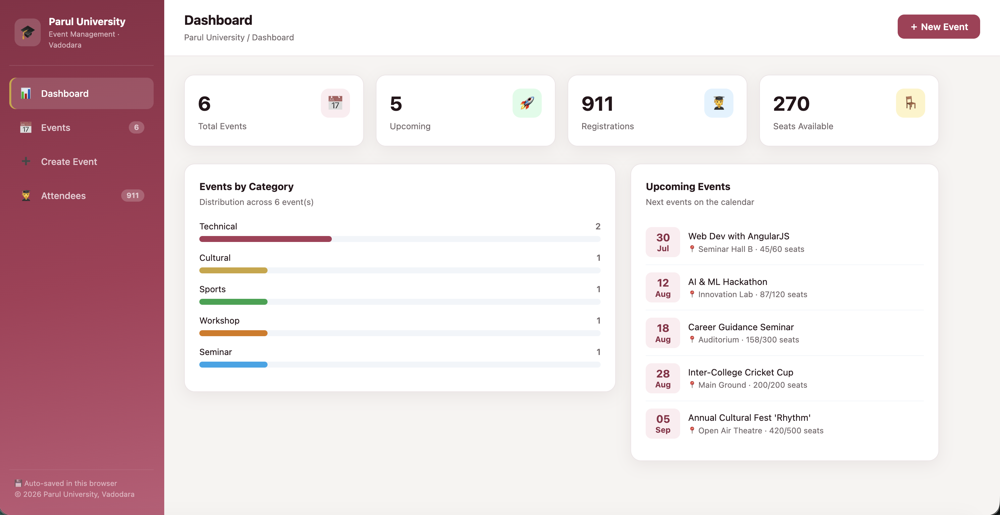
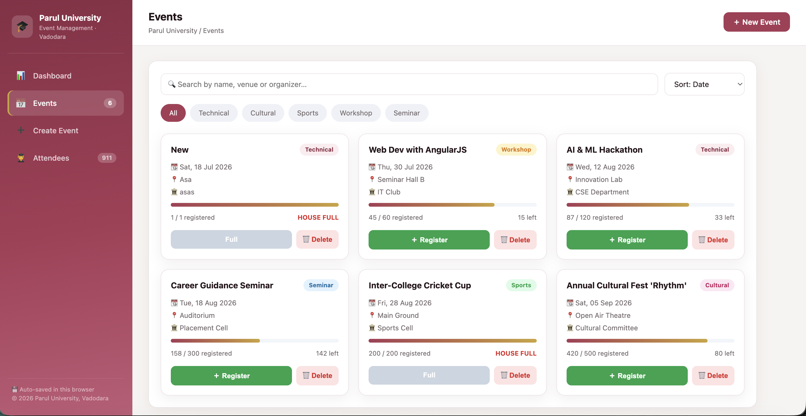
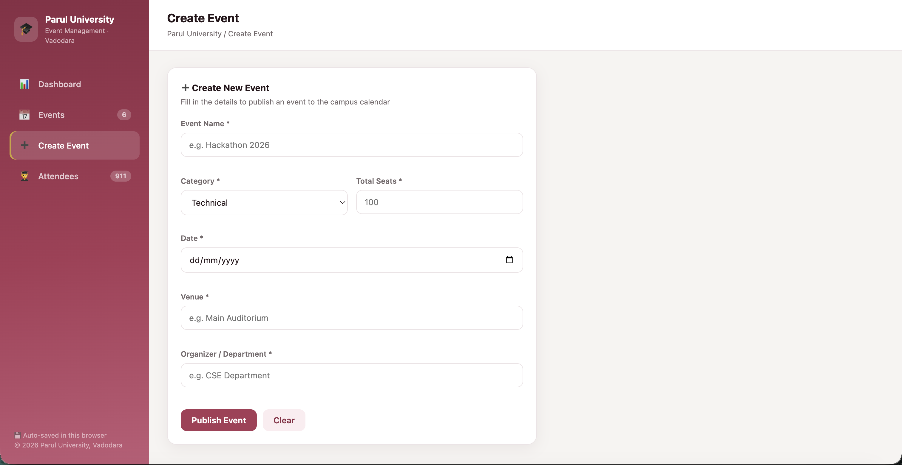

<h1 align="center">🎓 Campus Event Manager</h1>

<p align="center">
  A responsive, single-page <b>College Event Management System</b> for <b>Parul University, Vadodara</b>.<br>
  Plan, publish, and track campus events — right in the browser, with no backend required.
</p>

<p align="center">
  
  
  
  
</p>

---

## 📑 Table of Contents

- [Overview](#-overview)
- [Features](#-features)
- [Tech Stack](#️-tech-stack)
- [Screenshots](#️-screenshots)
- [Getting Started](#-getting-started)
- [Project Structure](#-project-structure)
- [How the Code Works](#-how-the-code-works)
- [Data Model](#-data-model)
- [How to Use](#-how-to-use)
- [Future Enhancements](#-future-enhancements)
- [License](#-license)

---

## 📖 Overview

**Campus Event Manager** is a lightweight web application that helps a college manage its events end to end — from publishing an event to registering students and tracking attendance. It is built as a single self-contained HTML file using **HTML, CSS, and AngularJS**, and stores all data in the browser using `localStorage`, so events and registrations persist across page refreshes without any database or server.

---

## ✨ Features

| Module | What it does |
| --- | --- |
| **📊 Dashboard** | Live stats — total events, upcoming events, total registrations, and seats available — plus an *Events by Category* breakdown chart and an upcoming-events list. |
| **📅 Events** | Browse events as cards with search, category filters, sorting, and live seat-availability bars. |
| **➕ Create Event** | Add a new event with complete form validation (required fields, past-date detection, seat limits) and errors that clear as you type. |
| **🎟️ Registration** | Register students through a modal (name, roll number, email) with email-format, duplicate-roll, and *house-full* protection. |
| **🧑‍🎓 Attendees** | A searchable table listing every registrant across all events. |
| **💾 Persistence** | Everything auto-saves to `localStorage` and reloads automatically on refresh. |
| **📱 Responsive** | The sidebar collapses into a slide-in drawer with a hamburger menu on mobile devices. |
| **🎨 Themed UI** | Parul University maroon & gold color scheme, toast notifications, and smooth transitions. |

---

## 🛠️ Tech Stack

- **HTML5** — semantic markup
- **CSS3** — custom properties (variables), flexbox, grid, and responsive media queries
- **AngularJS 1.8.2** — controllers, two-way data binding, filters, and directives (`ng-repeat`, `ng-if`, `ng-class`, `ng-model`)
- **Browser `localStorage`** — client-side data persistence

> No installation, no build tools, and no server required.

---

## 🖼️ Screenshots

### Dashboard
Live stats, an *Events by Category* breakdown, and upcoming events at a glance.



### Events
Browse events with search, category filters, sorting, and seat-availability bars.



### Create Event
Publish a new event with full form validation.



---

## 🚀 Getting Started

The entire application lives in a single `index.html` file, so there is nothing to install or build.

**Open it directly**
- Double-click `index.html`, or drag it into any modern web browser (Chrome, Edge, Firefox, or Safari).

**Or use VS Code Live Server** *(recommended for the smoothest experience)*
1. Open the project folder in **VS Code**.
2. Install the **Live Server** extension.
3. Right-click `index.html` → **Open with Live Server**.

> 💡 Because data is saved in `localStorage`, you can restore the original sample data anytime using the **↺ Reset to sample data** link at the bottom of the sidebar.

---

## 📂 Project Structure

```
campus-event-manager/
├── index.html          # The entire application (HTML + CSS + AngularJS)
├── README.md           # Project documentation
├── LICENSE             # MIT License
├── .gitignore          # Ignored files
└── screenshots/        # Images used in this README
    ├── Dashboard.png
    ├── Events.png
    └── Registration.png
```

---

## 🧠 How the Code Works

Everything is contained in `index.html` and organised into three parts: the **HTML template**, the **CSS styles**, and the **AngularJS script**. Below is a walkthrough of the key logic.

### 1. The AngularJS module and controller

The app registers a single module (`eventApp`) and one controller (`AppCtrl`) that holds all of the state and behaviour. `$scope` shares data with the HTML, and `$timeout` is used for the toast notifications.

```js
var app = angular.module("eventApp", []);

app.controller("AppCtrl", function ($scope, $timeout) {
    // ...all state and functions live here
});
```

The HTML is wired up in the `<body>` tag:

```html
<body ng-controller="AppCtrl">
```

### 2. Page navigation without a router

Instead of using a routing library, a single `view` variable decides which page is visible. Each page is wrapped in `ng-if`, and the sidebar links simply change `view`.

```js
$scope.view = "dashboard";
$scope.setView = function (v) { $scope.view = v; $scope.menuOpen = false; };
```

```html
<div class="nav-item" ng-click="setView('events')">Events</div>
...
<div ng-if="view=='events'"> <!-- Events page --> </div>
<div ng-if="view=='create'"> <!-- Create Event page --> </div>
```

### 3. Creating an event with validation

Validation is separated into a `validateForm()` function that returns an object of errors. `addEvent()` runs it on submit; a `$watchCollection` re-runs it on every keystroke *after the first submit*, so error messages clear live as the user fixes each field.

```js
function validateForm() {
    var f = $scope.form, errs = {};
    if (!f.title || !f.title.trim())  errs.title = "Event name is required.";
    if (!f.date)                      errs.date  = "Please pick a date.";
    else if (f.date < TODAY)          errs.date  = "Date is in the past.";
    if (!f.venue || !f.venue.trim())  errs.venue = "Venue is required.";
    var seats = parseInt(f.seats, 10);
    if (isNaN(seats) || seats < 1)    errs.seats = "Must be at least 1.";
    return errs;
}

// clear errors live once the user has attempted to submit
$scope.$watchCollection("form", function () {
    if (!$scope.submitted) return;
    $scope.fieldErr = validateForm();
});
```

### 4. Registering a student

A modal collects the student's details. The registration is rejected if the event is full or if the roll number is already registered.

```js
$scope.submitRegister = function () {
    var ev = $scope.modal.event, r = $scope.reg;
    // ...validate name / roll / email...

    if (ev.registered >= ev.seats) { $scope.modal.error = "This event is full."; return; }

    var duplicate = ev.registrants.some(function (s) {
        return s.roll.toLowerCase() === r.roll.trim().toLowerCase();
    });
    if (duplicate) { $scope.modal.error = "This roll number is already registered."; return; }

    ev.registrants.push({ name: r.name.trim(), roll: r.roll.trim(), email: r.email.trim() });
    ev.registered++;
};
```

### 5. Saving to the browser (persistence)

A deep `$watch` on the `events` array saves it to `localStorage` whenever anything changes, and re-computes the dashboard's derived data. On load, the app reads it back — falling back to the sample data if nothing is saved.

```js
$scope.$watch("events", function (list) {
    recompute();                                       // refresh dashboard data
    localStorage.setItem(STORAGE_KEY, JSON.stringify(list));
}, true);                                              // 'true' = deep watch
```

### 6. Search, filter & sort (the "dot rule")

The Events page lives inside an `ng-if`, which creates a **child scope**. If the filter state used plain variables, `ng-model` would silently write to that child scope and the controller would never see it. To avoid this, all filter state is kept inside a single **object** (`filters`), which is shared by reference across scopes — the well-known AngularJS *"always have a dot in your ng-model"* rule.

```js
$scope.filters = { search: "", cat: "", sortBy: "date" };

$scope.searchFilter = function (ev) {
    var q = ($scope.filters.search || "").toLowerCase();
    return !q || ev.title.toLowerCase().indexOf(q) > -1
              || ev.venue.toLowerCase().indexOf(q) > -1;
};
$scope.catMatch = function (ev) {
    return !$scope.filters.cat || ev.category === $scope.filters.cat;
};
```

```html
<input ng-model="filters.search">
<div ng-repeat="ev in events | filter:searchFilter | filter:catMatch | orderBy:sortKey()">
```

### 7. Dashboard data (avoiding an infinite digest)

Dashboard lists (category chart, upcoming events, attendees) are **pre-computed** into stored arrays rather than returned fresh from a function inside `ng-repeat`. Returning a new array on every digest cycle would make AngularJS loop forever (`$digest` never stabilises), so the data is refreshed only when `events` actually changes.

```js
function recompute() {
    $scope.categoryStatsData = $scope.categories.map(function (c) {
        var count = $scope.events.filter(function (e) { return e.category === c; }).length;
        return { name: c, count: count, pct: Math.round(count / total * 100) };
    });
    // ...upcomingListData, attendeesData...
}
```

---

## 🗂️ Data Model

Each event is a plain JavaScript object. Registrations are stored inside the event they belong to, and `registered` always equals `registrants.length`.

```js
{
    id: 1,                                  // unique id (Date.now() for new events)
    title: "AI & ML Hackathon",
    category: "Technical",                  // Technical | Cultural | Sports | Workshop | Seminar
    date: "2026-08-12",                     // YYYY-MM-DD
    venue: "Innovation Lab",
    organizer: "CSE Department",
    seats: 50,                              // total capacity
    registered: 5,                          // = registrants.length
    registrants: [
        { name: "Aarav Sharma", roll: "21CSE045", email: "aarav.sharma@paruluniversity.ac.in" }
    ]
}
```

---

## 📝 How to Use

1. **Dashboard** — get an at-a-glance summary of all events and registrations.
2. **Create Event** — fill in the event name, category, date, seats, venue, and organizer, then publish.
3. **Events** — search or filter events, and click **Register** to enroll a student.
4. **Attendees** — view and search the full list of registered students.

All changes are saved automatically in your browser.

---

## 🔮 Future Enhancements

- [ ] Export the attendees list as a CSV file
- [ ] Remove or edit an individual registrant
- [ ] Edit and update existing events
- [ ] Split into separate `index.html`, `app.js`, and `style.css` files
- [ ] Add event posters / image uploads

---

## 📄 License

This project is licensed under the **MIT License** — see the [LICENSE](LICENSE) file for details.

---

<p align="center">Made with ❤️ for <b>Parul University, Vadodara</b></p>
